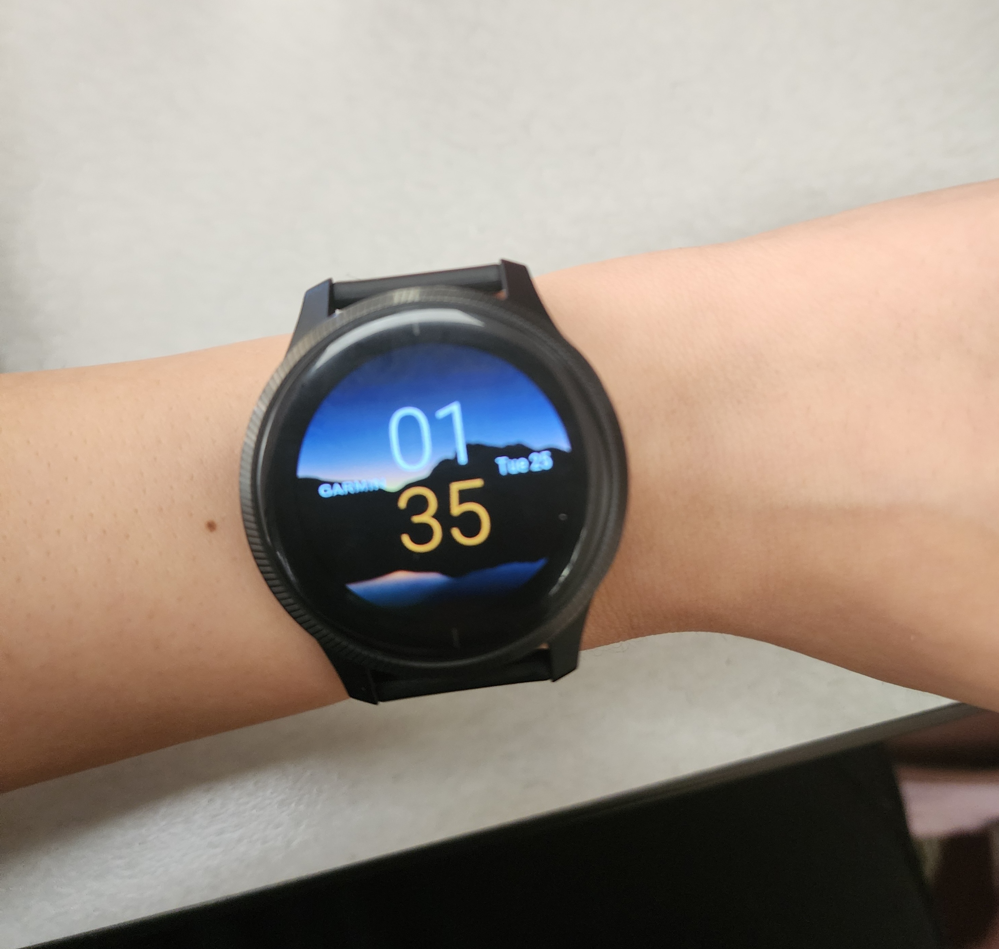
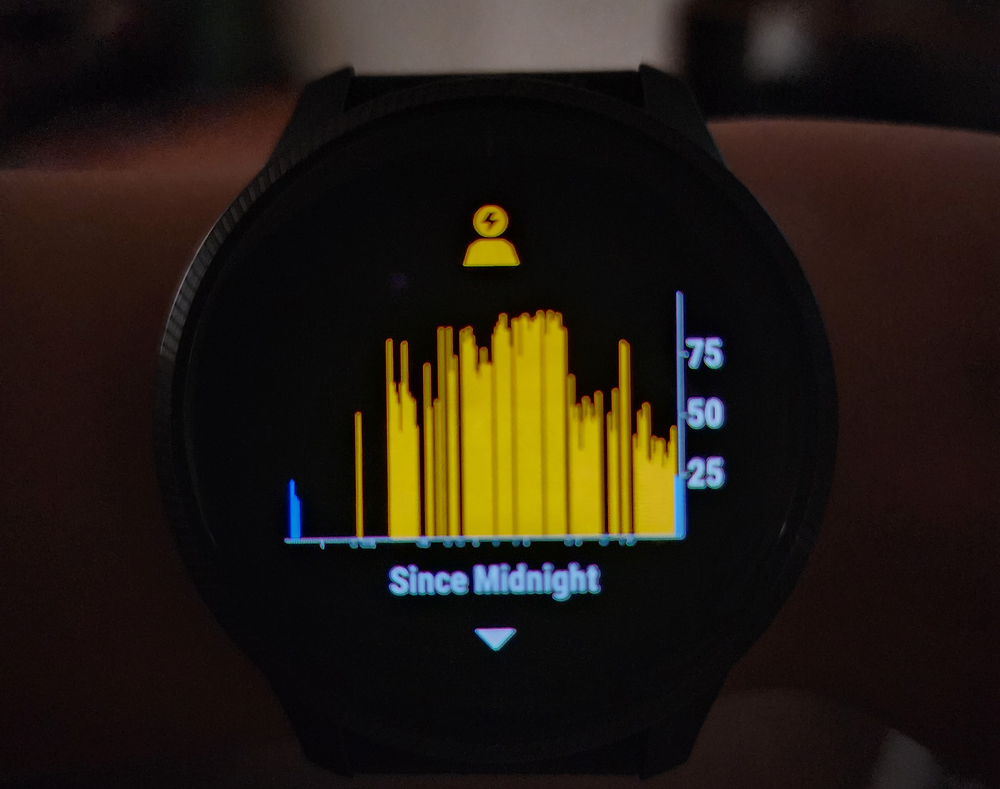

**Living with a Smartwatch: A Day of Health Monitoring**  
**By Elizabeth Rodriguez**
**March 25, 2025**
**(REVISED May 12, 2025)**  

  

Smartwatches have evolved from simple timekeepers to powerful health companions. Recently, I spent a day relying on my smartwatch to monitor various health metrics from **heart rate** and **sleep quality** to **activity tracking** and **stress levels**. My goal was to see how well this device could support my overall well-being. The experience was enlightening, revealing both impressive capabilities and frustrating limitations.

### The Interaction

From the moment I woke up, my smartwatch had already delivered insights into my sleep quality, including total sleep duration and time spent in each sleep stage (light, deep, and REM). The breakdown was visual, digestible, and immediately useful—an example of effective feedback that supports reflection and improvement.

Later, during my morning jog, the watch automatically kicked in to track my distance, pace, and heart rate without needing manual input. Seeing real-time stats on my wrist mid-run motivated me to push harder—a great example of how real-time feedback can positively reinforce behavior.

Throughout the day, the smartwatch tracked my steps, calories burned, and gently nudged me to stand when I’d been sedentary too long. These subtle prompts encouraged me to stay active without being disruptive—micro-interactions done right.

#### Checking Stress Levels
One moment that didn’t feel as smooth was checking my stress level. Unlike sleep or step tracking, this wasn’t a quick glance.

  

To check it, I had to either press the top button or twist my wrist to wake the screen, then swipe through two screens to get to the Health Stats. From there, I had to wait while it finished calculating stress, heart rate, energy, and breathing. Eventually, I saw a bar showing my current stress level but by then, the moment I felt stressed had mostly passed.

It wasn’t terrible—but it also wasn’t instant. For something as time-sensitive as stress, it should be faster and easier to access. Just a simple shortcut or clearer placement could make a big difference.

### Assessing the User Experience

One key concept that stood out was the importance of a mental model how we expect technology to work. I assumed all health metrics would be easily accessible from the main dashboard. Instead, some features were buried in submenus, making it difficult to check certain stats quickly. Aligning the interface with user expectations could greatly improve the experience.

Another critical element was the accuracy of the data. While step counts and heart rate seemed reliable, the calorie burn estimates appeared inconsistent. On less active days, the watch still reported high calorie burn numbers, which made me question the device's precision.

### Strengths and Weaknesses

The smartwatch excels at providing real-time feedback and encouraging healthier habits through gentle reminders. Its sleek interface makes it enjoyable to use, and the convenience of having multiple health metrics in one place is undeniable. However, issues with efficiency and accuracy in certain metrics can undermine trust in the data.

### Suggestions for Improvement

To improve the user experience, smartwatch developers could consider:
- Consolidate key health metrics on a customizable dashboard for quicker access.
- Improve accuracy by refining algorithms for calorie burn and stress detection.
- Offer more granular feedback, such as tips for improving sleep or reducing stress, to make the data actionable.

### Final Thoughts
This day-long experience showed me how valuable smartwatches can be when it comes to reinforcing healthier habits. The real-time feedback, motivational prompts, and consolidated tracking made me feel more aware of my health choices. However, a few usability issues especially around accessibility and efficiency—stood in the way of it being a seamless experience.

With a few targeted UX improvements, smartwatches can evolve from useful tools to indispensable wellness partners that people genuinely enjoy using every day.

